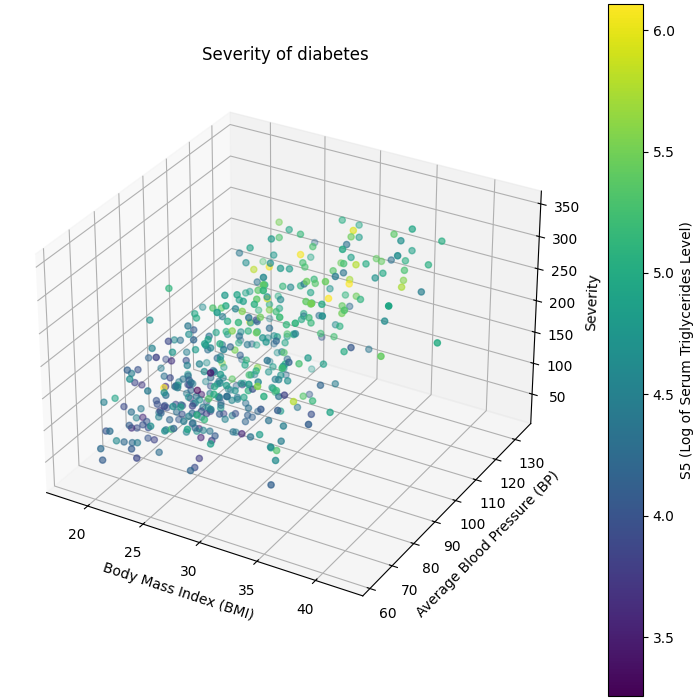

## Multi-Linear-Regression-Model-for-Diabetes-Analysis

A simple machine learning project using multi-linear regression to predict disease progression based on features from the diabetes dataset.

### Overview

This project uses multi-linear regression to predict disease progression based on patient features from the diabetes dataset. The main objective is to explore feature importance and investigate the use of a custom gradient descent implementation. The results are verified against SGDRegressor from scikit-learn.

### Features

-   Custom Gradient Descent Implementation: Handles multi-linear regression from scratch.
-   Model Verification: Results validated by comparing with SGDRegressor.
-   Feature Impact Analysis: Uses data visualization to assess the influence of each feature.
-   Prediction of Disease Progression: Based on patient metrics provided in the dataset.

### Dataset

-   Contains 10 baseline features (like BMI, age, etc.) to predict disease progression over time.

-   Source: [Diabetes Dataset - scikit-learn](https://scikit-learn.org/stable/modules/generated/sklearn.datasets.load_diabetes.html)

### Results

